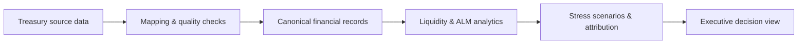
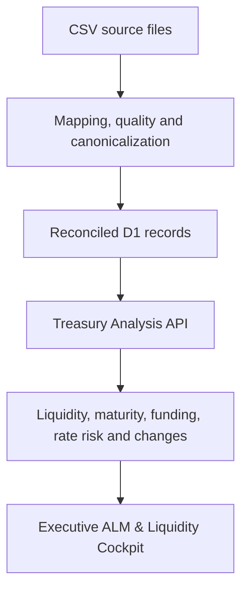

# Corporate ALM Intelligence

**A treasury analytics prototype for liquidity, funding, maturity-gap, and interest-rate-risk decision support.**

Corporate ALM Intelligence explores how fragmented treasury and balance-sheet data can be transformed into a structured, explainable management view for finance teams. The prototype combines source-data normalization, deterministic risk logic, scenario analysis, and an executive dashboard to support short- and medium-term treasury decisions.

> **Project focus:** corporate treasury, asset-liability management, liquidity forecasting, funding risk, financial data quality, and decision-support systems.

## Why this project

Corporate finance teams often work with data distributed across ERP exports, spreadsheets, debt schedules, bank positions, and manually maintained assumptions. Even when the underlying information exists, answering basic management questions can require substantial reconciliation and interpretation.

This project was built around a practical question:

> **Can heterogeneous treasury data be converted into a transparent and reproducible decision-support layer that explains not only what the liquidity position is, but why it changes and where the main risks come from?**

The prototype therefore focuses on four principles:

1. **Traceability** — source data is mapped, reconciled, and checked before analysis.
2. **Explainability** — risk outputs are deterministic and linked to their financial drivers.
3. **Scenario awareness** — management can compare Base, Moderate, and Severe assumptions.
4. **Decision relevance** — outputs are organized around liquidity, funding, maturity, rate risk, and priority actions rather than raw accounting records.

## Financial questions explored

The application is designed to answer questions such as:

- What is the projected liquidity position over the next 90 days?
- On which date does liquidity reach its minimum, and what transactions drive that gap?
- Are committed credit facilities sufficient to cover projected funding needs?
- How does liquidity change under Moderate and Severe stress scenarios?
- Which counterparties contribute most to a projected cash shortfall?
- What changed between the previous and current datasets, and how much did each change affect liquidity?
- Where are the largest contractual maturity concentrations over the next 12 months?
- What does the 36-month debt wall imply for refinancing needs?
- How sensitive is annual interest expense to +100, +200, or +300 basis-point shocks?
- Which risk pillar should management address first?

## Analytical approach

The system follows a source-to-decision pipeline:



### 1. Data ingestion and reconciliation

The importer accepts treasury datasets such as `payables`, `receivables`, and `debt`, recognizes common aliases including SAP-style field names, validates the structure, and converts records into a canonical internal model.

The pipeline includes:

- automatic column mapping
- data-quality checks
- persisted issue records
- source-to-canonical reconciliation
- dataset contracts by financial source type

### 2. Liquidity forecasting

The engine builds a 90-day cash-flow forecast from opening liquidity, expected inflows, expected outflows, debt-related items, and available committed facilities.

It calculates seven executive metrics and identifies the minimum-liquidity date automatically.

### 3. Stress testing

Three deterministic scenarios — **Base, Moderate, and Severe** — allow comparison of:

- minimum projected cash
- funding requirement
- threshold-breach days
- first breach date
- scenario-level liquidity paths

### 4. Gap-driver analysis

For the most stressed date, the system decomposes the liquidity position into its underlying drivers and measures counterparty concentration within the relevant gap window.

### 5. What Changed analysis

Current and previous datasets can be compared to detect:

- amount changes
- date shifts
- new records
- removed records

The system then translates these record-level changes into their impact on projected liquidity through a movement and attribution bridge.

### 6. Maturity, funding, and interest-rate risk

The broader ALM layer includes:

- **12-month contractual maturity gap**
- **36-month debt and funding wall**
- **facility utilization and refinancing need**
- **lender concentration**
- **12-month interest-rate repricing ladder**
- **weighted average rate and annual interest expense**
- **+100 / +200 / +300 bps sensitivity analysis**

### 7. Executive overview

The executive layer consolidates liquidity, stress, maturity, funding, interest-rate, and data-quality results into a common management status:

`HEALTHY` · `WATCH` · `ACTION_REQUIRED` · `CRITICAL`

It also identifies the dominant risk pillar and ranks the three highest-priority actions by severity and estimated financial impact.

## Current product scope

- CSV ingestion and automatic column mapping, including SAP aliases
- Data-quality checks and persisted issue records
- Canonical treasury records in D1
- Source-to-canonical reconciliation
- Dataset contracts for `payables`, `receivables`, and `debt`
- 90-day liquidity forecast
- Seven CFO metrics and deterministic CFO verdict
- Base, Moderate, and Severe stress scenarios
- What Changed record comparison
- Forecast movement reconciliation and attribution bridge
- Gap Drivers and counterparty concentration
- 12-month contractual maturity-gap analysis
- 36-month debt and funding analysis
- 12-month interest-rate repricing and shock sensitivity
- Executive ALM Overview with prioritized actions
- Responsive CFO Liquidity Cockpit
- Universal Data Importer with mapping review and quality findings
- Interactive stress chart with date-level Gap Drivers drill-down

## Demo data and privacy

The repository is designed to run with **synthetic/demo financial data**. It does not require confidential company data to demonstrate the analytical workflow.

The included sample datasets can be processed through the same ingestion and analysis pipeline used by the application.

## Using the application

The cockpit opens with the data importer. Upload one or more current-period CSVs and run the analysis, or use **Load demo data** to explore the interface without persisted imports. Previous-period files are optional and enable What Changed.

For an end-to-end local test, use **Run with sample CSVs**. It uploads the six files under `public/samples` through the real ingestion API — current and previous `payables`, `receivables`, and `debt` — and then runs the complete treasury analysis.

The **Cash & Credit Facilities** panel supports persisted manual ALM positions. Cash entries automatically populate opening liquidity; undrawn committed facilities populate available facilities. This also allows a flat liquidity analysis to run before receivable, payable, or debt files are uploaded.

## Architecture



## Local development

```bash
npm ci
npm run typecheck
npm run lint
npm test
npm run dev
```

Apply D1 migrations before testing API routes against a fresh local database:

```bash
npx wrangler d1 migrations apply treasury-intelligence-db --local
```

## API flow

### Manual ALM positions

```bash
curl -s -X POST http://localhost:5173/api/alm/positions \
  -H "content-type: application/json" \
  -d '{
    "positionType": "cash",
    "entity": "1000",
    "counterpartyName": "Demo Bank",
    "referenceId": "TR-001",
    "currency": "TRY",
    "asOfDate": "2026-08-14",
    "availableAmount": 25000000,
    "restrictedAmount": 2000000
  }'
```

Use `GET /api/alm/positions?currency=TRY` for the position list and liquidity summary. Credit-facility entries use `positionType: "facility"`, `committedAmount`, and `drawnAmount`; the API derives the available amount.

### 1. Upload each current source dataset

```bash
curl -s -X POST http://localhost:5173/api/imports/analyze \
  -F "sourceType=payables" \
  -F "file=@tests/fixtures/sap-payables.csv"
```

Repeat for `receivables` and `debt`. Keep the returned `import.importId` values.

### 2. Build the CFO analysis package

```bash
curl -s -X POST http://localhost:5173/api/treasury/analyze \
  -H "content-type: application/json" \
  -d '{
    "importIds": [
      "CURRENT_PAYABLES_IMPORT_ID",
      "CURRENT_RECEIVABLES_IMPORT_ID",
      "CURRENT_DEBT_IMPORT_ID"
    ],
    "currency": "TRY",
    "asOfDate": "2026-08-14",
    "openingLiquidity": 25000000,
    "unusedCommittedFacilities": 10000000,
    "minimumLiquidityBuffer": 5000000
  }'
```

The response contains:

- `analysis.forecast`
- `analysis.metrics`
- `analysis.verdict`
- `analysis.stress`
- `analysis.gapDrivers`
- `analysis.maturityGap`
- `analysis.debtFunding`
- `analysis.interestRateRisk`
- `analysis.executiveOverview`

`gapTargetDate` is optional. If omitted, Gap Drivers automatically explains the minimum-liquidity date.

### 3. Add previous-period imports for What Changed

Pass a matching previous import for every current source type:

```json
{
  "previousImportIds": [
    "PREVIOUS_PAYABLES_IMPORT_ID",
    "PREVIOUS_RECEIVABLES_IMPORT_ID",
    "PREVIOUS_DEBT_IMPORT_ID"
  ]
}
```

When `previousImportIds` is present, the response also includes:

- `changes.comparison`: amount changes, date shifts, new items, and removed items
- `changes.movement`: closing-liquidity reconciliation
- `changes.forecastBridge`: driver-by-driver closing and minimum-liquidity attribution

The current and previous source-type sets must match so that missing datasets are not misclassified as removed or new records.

## Scope and limitations

This is a prototype and research-oriented decision-support project rather than a production treasury-management system. Its outputs depend on the completeness and quality of the supplied data and on explicitly defined deterministic assumptions. Hedge valuation, derivative pricing, stochastic interest-rate modeling, and production ERP/banking integrations are outside the current scope.
