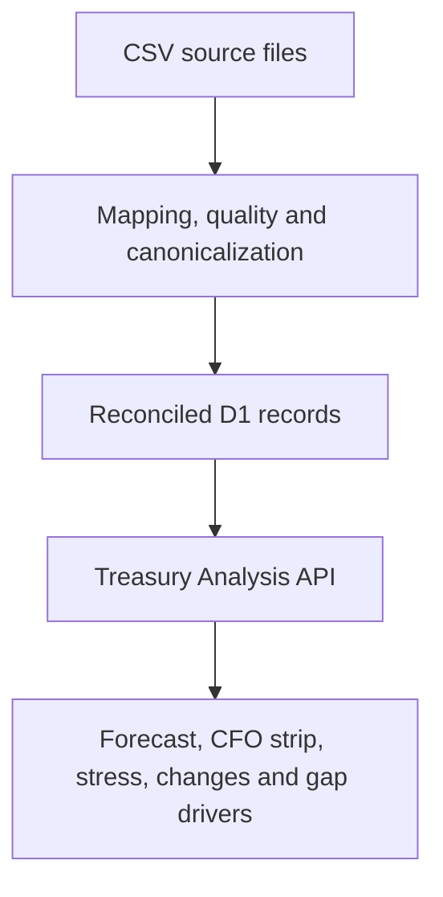

# Corporate ALM Intelligence

Corporate ALM Intelligence turns treasury and balance-sheet source data into deterministic liquidity, maturity-gap, funding, and interest-rate-risk decisions for finance teams. The current application delivers the 90-day liquidity, 12-month contractual maturity-gap, and 36-month debt-and-funding layers.

## Current product scope

- CSV ingestion and automatic column mapping, including SAP aliases
- Data-quality checks and persisted issue records
- Canonical treasury records in D1
- Source-to-canonical reconciliation
- Dataset contracts for `payables`, `receivables`, and `debt`
- 90-day liquidity forecast
- Seven CFO metrics and deterministic CFO verdict
- Base, Moderate, and Severe stress scenarios
- What Changed record comparison
- Forecast movement reconciliation and attribution bridge
- Gap Drivers and counterparty concentration
- Responsive CFO Liquidity Cockpit connected to the analysis API
- Universal Data Importer UI with current/previous-period uploads, mapping review, quality findings, and reconciliation status
- Interactive Base/Moderate/Severe chart with date-level Gap Drivers drill-down
- CFO metric strip, deterministic verdict, stress comparison, and What Changed movement bridge

The cockpit opens with the data importer. Upload one or more current-period CSVs and run the analysis, or use **Demo veriyi yükle** to explore the complete interface without persisted imports. Previous-period files are optional and enable What Changed.

For an end-to-end local test, use **Örnek CSV’lerle çalıştır**. It uploads the six files under `public/samples` through the real ingestion API (current and previous `payables`, `receivables`, and `debt`) and then runs the complete treasury analysis. Apply the local D1 migrations first.

The **Nakit ve kredi limitleri** panel supports persisted manual ALM positions. Cash entries automatically populate opening liquidity; undrawn committed facilities populate available facilities. This also allows a flat liquidity analysis to run before receivable, payable, or debt files are uploaded.

Every treasury analysis response also includes `analysis.maturityGap`. It assigns overdue items plus the following 365 days to deterministic maturity buckets, separates contractual assets and liabilities, calculates net and cumulative gap, and shows the residual funding need after available committed facilities. Drawn manual facilities enter the liability ladder at maturity; matching debt and facility references are de-duplicated.

`analysis.debtFunding` builds a 36-month quarterly debt wall from outstanding principal and drawn facilities. It calculates debt due within 12/24/36 months, residual 12-month refinancing need after undrawn facilities, facility utilization, the largest maturity wall, and lender concentration. Debt and facility references are de-duplicated before funded debt is totaled.

## Local commands

```bash
npm ci
npm run typecheck
npm run lint
npm test
npm run dev
```

Apply D1 migrations before testing API routes against a fresh local database:

```bash
npx wrangler d1 migrations apply treasury-intelligence-db --local
```

## API flow

### Manual ALM positions

```bash
curl -s -X POST http://localhost:5173/api/alm/positions \
  -H "content-type: application/json" \
  -d '{
    "positionType": "cash",
    "entity": "1000",
    "counterpartyName": "Demo Bank",
    "referenceId": "TR-001",
    "currency": "TRY",
    "asOfDate": "2026-08-14",
    "availableAmount": 25000000,
    "restrictedAmount": 2000000
  }'
```

Use `GET /api/alm/positions?currency=TRY` for the position list and liquidity summary. Credit-facility entries use `positionType: "facility"`, `committedAmount`, and `drawnAmount`; the API derives the available amount.

### 1. Upload each current source dataset

```bash
curl -s -X POST http://localhost:5173/api/imports/analyze \
  -F "sourceType=payables" \
  -F "file=@tests/fixtures/sap-payables.csv"
```

Repeat for `receivables` and `debt`. Keep the returned `import.importId` values.

### 2. Build the CFO analysis package

```bash
curl -s -X POST http://localhost:5173/api/treasury/analyze \
  -H "content-type: application/json" \
  -d '{
    "importIds": [
      "CURRENT_PAYABLES_IMPORT_ID",
      "CURRENT_RECEIVABLES_IMPORT_ID",
      "CURRENT_DEBT_IMPORT_ID"
    ],
    "currency": "TRY",
    "asOfDate": "2026-08-14",
    "openingLiquidity": 25000000,
    "unusedCommittedFacilities": 10000000,
    "minimumLiquidityBuffer": 5000000
  }'
```

The response contains:

- `analysis.forecast`
- `analysis.metrics`
- `analysis.verdict`
- `analysis.stress`
- `analysis.gapDrivers`
- `analysis.maturityGap`
- `analysis.debtFunding`

`gapTargetDate` is optional. If omitted, Gap Drivers automatically explains the minimum-liquidity date.

### 3. Add previous-period imports for What Changed

Pass a matching previous import for every current source type:

```json
{
  "previousImportIds": [
    "PREVIOUS_PAYABLES_IMPORT_ID",
    "PREVIOUS_RECEIVABLES_IMPORT_ID",
    "PREVIOUS_DEBT_IMPORT_ID"
  ]
}
```

When `previousImportIds` is present, the response also includes:

- `changes.comparison`: amount changes, date shifts, new items, and removed items
- `changes.movement`: closing-liquidity reconciliation
- `changes.forecastBridge`: driver-by-driver closing and minimum-liquidity attribution

The current and previous source-type sets must match so that missing datasets are not misclassified as removed or new records.

## Architecture


